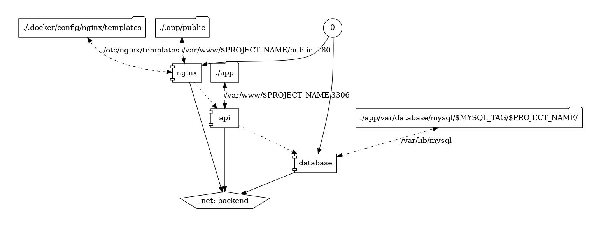

My aim for this article is to share how I run build and run [Symfony](https://symfony.com) applications that support dev through to production environments

I've been using [Docker](https://docker.com) for most of my career and it's enabled me to create dev environments for teams that i've worked alongside over the last 5 years

This is just what I feel works best, by no means anything officials :)

____
### Directory Structure
> supports symfony app running locally with [nginx](https://en.wikipedia.org/wiki/Nginx) ->  [reverse proxy](https://en.wikipedia.org/wiki/Reverse_proxy) -> [php-fpm](https://en.wikipedia.org/wiki/PHP#PHPFPM)

```
project-name
│   README.md
│   .env.exmaple
│   .gitignore
│   Dockerfile
│   docker-compose.yml
└───app
│   │   .env
│   │   composer.{json,lock}
│   │   phpstan.neon
│   │   .php-cs-fixer.dist.php
│   └───bin
│   └───src
│   └───tests
│       └───Unit
│       └───Functional
│       └───Integration
└───.docker
│   │   dev-env-visual.png
│   │
│   └───config
│        └───php
│        │      php.ini.development
│        │      php.ini.production
│        │      www.conf
│        └───nginx/templates
│               default.conf.template
```
____
### 2. Local Development
#
> [This](https://hub.docker.com/r/pmsipilot/docker-compose-viz) is a useful image to create diagrams from your compose files, credit to [msipilot/docker-compose-viz](https://github.com/pmsipilot/docker-compose-viz)


```
docker run --rm -it -v $(pwd):/input/ -u 0 pmsipilot/docker-compose-viz render -m image --force
```

A quick glance at the diagram and we can start to see how the project is setup. 3 containers running `nginx`, `api` & `mysql` with respective volumes where needed. A [Docker Network](https://docs.docker.com/network/) running the [default bridge mode](https://docs.docker.com/network/bridge/) to enable tcp communication between container services

____
### 3. Docker Compose w/ .env
```:title=project-name/docker-compose.yml
version: '3'

networks:
  backend:

services:
  nginx:
    container_name: nginx
    restart: unless-stopped
    image: nginx:$NGINX_TAG
    command: [nginx-debug, '-g', 'daemon off;']
    healthcheck:
      test: ["CMD", "curl" ,"--fail", "http://localhost"]
      timeout: 5s
      retries: 5
    ports:
      - $NGINX_PORT:80
    environment:
      NGINX_HOST: $NGINX_HOST
      NGINX_PORT: $NGINX_PORT
      PROJECT_NAME: $PROJECT_NAME
    volumes:
      - ./.docker/config/nginx/templates:/etc/nginx/templates
      - ./.app/public:/var/www/$PROJECT_NAME/public
    depends_on:
      - api
    networks:
      - backend

  database:
    container_name: mysql
    restart: unless-stopped
    image: mysql:$MYSQL_TAG
    healthcheck:
      test: ["CMD", "mysqladmin" ,"ping", "-h", "localhost"]
      timeout: 20s
      retries: 10
    ports:
      - $MYSQL_PORT:3306
    environment:
      MYSQL_ROOT_PASSWORD: $MYSQL_ROOT_PASSWORD
    volumes:
      - ./app/var/database/mysql/$MYSQL_TAG/$PROJECT_NAME/:/var/lib/mysql
    networks:
      - backend

  api:
    container_name: api
    build:
      target: dev
      context: .
      args:
        PHP_VERSION: $PHP_VERSION
        COMPOSER_TAG: $COMPOSER_TAG
        PROJECT_NAME: $PROJECT_NAME
    depends_on:
      - database
    restart: unless-stopped
    volumes:
      - ./app:/var/www/$PROJECT_NAME
    networks:
      - backend
```

When running `docker-compose up` compose will grab the values form the root `.env` and switcheroo them with the compose file references like; `$PHP_VERSION, $COMPOSER_TAG`, this allows us to centralise and pin version numbers and also keep sensitive passwords out of version control for any local services we want to use throughout the project! nice.


For the sake of **DX** I also tend commit a `.env.example` with sensible and required project defaults
```:title=project-name/.env.example
# Host Config
NGINX_HOST=dev.dating.api
NGINX_PORT=80
PROJECT_NAME=dating-api

# MySQL
MYSQL_ROOT_PASSWORD=SeCuRiTy
MYSQL_PORT=3307 # avoid confliting local services

# Versions
PHP_VERSION=8.0
COMPOSER_TAG=2.1.9
MYSQL_TAG=8.0
NGINX_TAG=stable
```

___
### 4. Multistage Dockerfile

Stages;
 1. **composer** install non dev dependencies
 2. **php-fpm-alpine**
    - php.ini
    - [recommended install tool for php extensions](https://github.com/mlocati/docker-php-extension-installer)
 3. Dev Stage
    - set work dir
    - copy app code in
    - copy vendor in
    - install dev dependencies
    - clear symfony cache
    - create health-check

```:Dockerfile
ARG PHP_VERSION=8.0
ARG COMPOSER_TAG=2.1.9
ARG BUILD_ENV=dev
ARG PROJECT_NAME=dating-api

# Vendor
FROM composer:$COMPOSER_TAG AS dependencies
COPY app/composer.* /app/
COPY app/symfony.lock /app/
RUN composer install --ignore-platform-reqs --no-scripts --no-dev
LABEL image=dependencies

FROM php:${PHP_VERSION}-fpm-alpine AS base

# PHP
COPY .docker/config/php/php.ini.production $PHP_INI_DIR/php.ini

# Tooling
RUN apk --update add zip libzip-dev curl

# PHP Extenstions
ADD https://github.com/mlocati/docker-php-extension-installer/releases/latest/download/install-php-extensions /usr/local/bin/
RUN chmod +x /usr/local/bin/install-php-extensions && sync && \
    install-php-extensions gd intl && \
    docker-php-ext-install pdo_mysql zip

FROM base as dev
ARG PROJECT_NAME=dating-api

COPY .docker/config/php/php.ini.development $PHP_INI_DIR/php.ini
RUN install-php-extensions xdebug @composer-2.0.2
WORKDIR /var/www/${PROJECT_NAME}

# Copy in app
COPY app /var/www/${PROJECT_NAME}

# Copy in vendor
COPY --from=dependencies app/vendor vendor

# Install dev deps
RUN composer install --no-scripts

# Generate public/private keys for JWT use
RUN bin/console lexik:jwt:generate-keypair

RUN mkdir -p var/log var/cache && \
    chmod -R 777 var/log var/cache

HEALTHCHECK --interval=30s --timeout=30s --start-period=5s --retries=3 \
    CMD php-fpm -t || exit 1
```

___

## Part two coming soon


